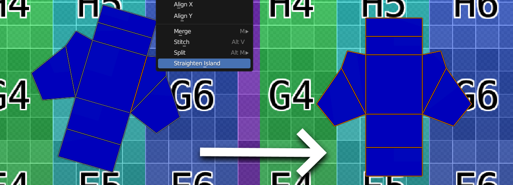

# Straighten UV Island

## Overview

This add-on helps straighten a UV island by selecting two vertices, and clicking "Straighten Island" from the UV context menu.

The island will be rotated to best align along the closest axis.  
The center of rotation is the midpoint between the two selected vertices.

## Limitations

This add-on is extremely simple, and does not account for a vast amount of situations. Some of these limitations may be addressed in the future.

For this add-on to correctly work, the following criteria must be met:

- The option "UV Sync Selection" must be **off** (see top left in the UV editor type)
- Strictly two vertices on the same island must be selected
    - There is no bulk, or per-island functionality
- Only one object must be selected in edit mode

## Installation

- Navigate to the latest [release](https://github.com/romenjelly/blender_straighten_uv_island/releases/latest), and download the `straighten_uv_island.zip` file. No need to extract it.
- In Blender, click on `Edit` -> `Preferences`
- In the preferences window, navigate to the `Add-ons` tab
- Click on "Install" (top right)
- Find and select your downloaded release in the newly opened file explorer
- Click on "Install Add-on"
- Check the checkbox next to "UV: Straighten UV Island" in the preferences window to enable the add-on

## License

This add-on is licensed under GPL. See [LICENSE](LICENSE).

Code from [Blender TexTools](https://github.com/SavMartin/TexTools-Blender/tree/master) is used. See [LICENSE_TexTools](LICENSE_TexTools).
